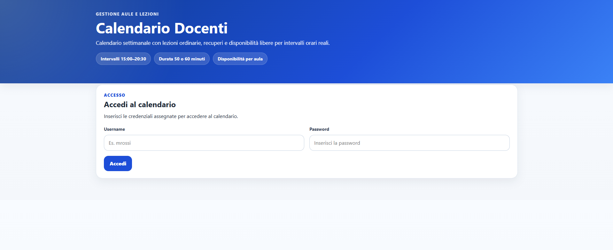
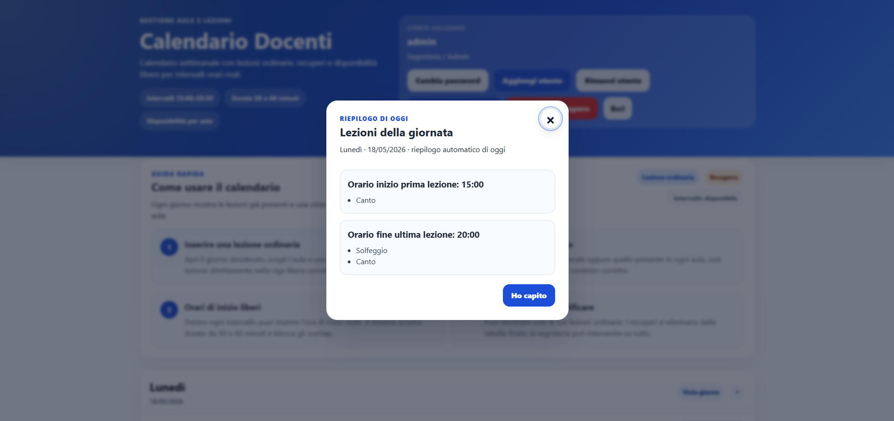
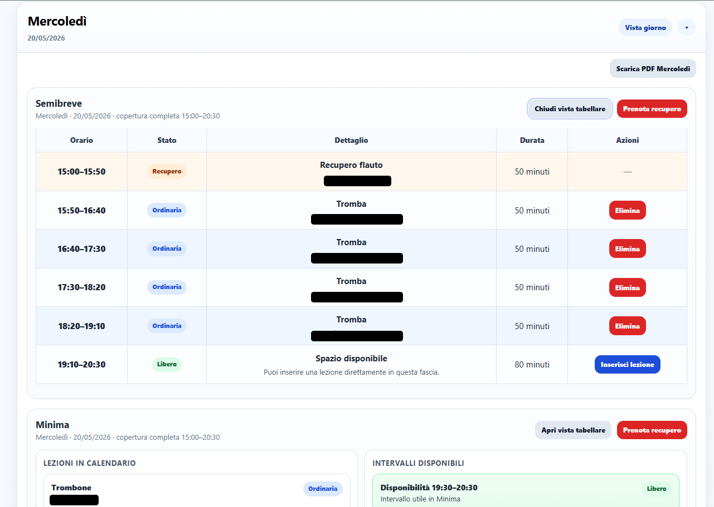

# Software Applications Lab

A collection of lightweight web applications and workflow tools developed to solve practical problems for real users.

This repository collects management-oriented software applications, scheduling utilities and operational tools, with a focus on simple interfaces, clear workflows and real-world usability.

## Projects

| Project | Type | Domain | Status | Live Demo |
|---|---|---|---|---|
| Teachers Calendar Manager | Web Management Application | Scheduling / Operations | Deployed | [Open](https://www.accademiamusicalegirolamoscarasciullo.com/CalendarioDocenti/calendariodocenti.html) |

## Screenshots

### Teachers Calendar Manager

Teachers Calendar Manager is a web-based scheduling application developed to support the operational workflow of a music school.

The application helps manage teacher schedules, room availability, ordinary lessons, recovery lessons and daily calendar views.

### Main features

- Teacher login
- Weekly calendar view
- Daily calendar view
- Room-based availability management
- Ordinary lesson scheduling
- Recovery lesson scheduling
- Teacher-specific workflows
- User management
- Password change and reset flow
- PDF export
- Overlap prevention for conflicting bookings

### Engineering focus

This project demonstrates practical software engineering skills applied to a real operational need:

- translating a real workflow into a usable web application;
- designing scheduling logic around teachers, rooms and lesson durations;
- preventing conflicting bookings;
- managing different user interactions;
- building a simple interface for non-technical users;
- deploying a working tool in a real context.

## Portfolio relevance

Although my main technical focus is on control systems, embedded systems, model-based design and optimization, this repository shows my ability to build complete software tools for real users.

It complements my engineering portfolio by demonstrating:

- user-facing web application development;
- workflow-oriented software design;
- practical problem solving;
- deployment of usable applications;
- documentation of real-world software projects.

## Next steps

- Add screenshots
- Add a system overview
- Document the scheduling logic
- Add technical implementation details
- Consider moving the Teachers Calendar Manager into a standalone repository
