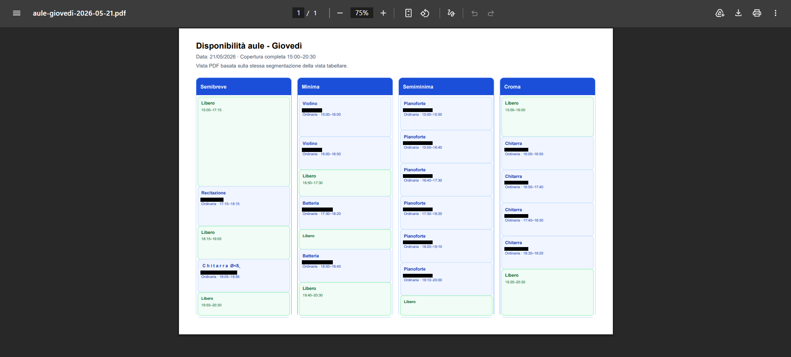

# Software Applications Lab

A showcase repository for practical web applications, workflow tools and management-oriented software projects developed to solve real operational needs.

The projects listed here focus on simple interfaces, clear workflows and real-world usability, especially in scheduling, organization and lightweight management contexts.

This repository acts as an entry point to individual applications, live demos and dedicated project repositories.

---

## Projects

| Project | Type | Domain | Repository | Live Demo | Status |
|---|---|---|---|---|---|
| Teachers Calendar Manager | Web Management Application | Scheduling / Operations | [Repository](https://github.com/mikabba/teachers-calendar-manager) | [Open](https://www.accademiamusicalegirolamoscarasciullo.com/CalendarioDocenti/calendariodocenti.html) | Deployed |

---

## Featured application

### Teachers Calendar Manager

Teachers Calendar Manager is a web-based scheduling application developed to support the operational workflow of a music school.

The application helps manage teacher schedules, room availability, ordinary lessons, recovery lessons and daily calendar views.

**Main features**

- Teacher login
- Weekly and daily calendar views
- Room-based availability management
- Ordinary and recovery lesson scheduling
- Teacher-specific workflows
- User management
- Password change and reset flow
- PDF export
- Overlap prevention for conflicting bookings

**Links**

- [Live demo](https://www.accademiamusicalegirolamoscarasciullo.com/CalendarioDocenti/calendariodocenti.html)
- [Project repository](https://github.com/mikabba/teachers-calendar-manager)

---

## Screenshots

### Login

### After login

### Weekly view

### PDF export

---

## Why this repository exists

This repository collects practical software tools built around real operational needs.

The goal is to document small but complete applications that translate real workflows into usable web-based tools for non-technical users.

---

## Portfolio relevance

These projects complement my main engineering portfolio by demonstrating my ability to:

- translate real user needs into working software applications;
- design workflow-oriented tools for practical contexts;
- build simple interfaces for non-technical users;
- implement scheduling logic and conflict-prevention mechanisms;
- deploy usable applications in real environments;
- organize software projects into documented, reusable repositories.

---

## Repository role

This repository serves as the central index for my applied software and workflow-oriented tools.

Each mature application is documented here and maintained in its own dedicated repository with source code, screenshots, usage notes and implementation details.
